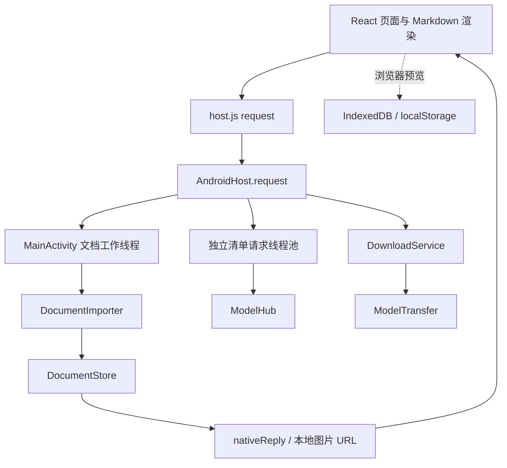
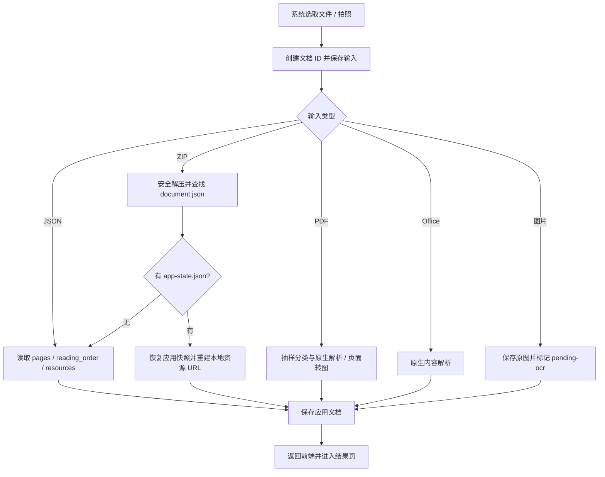

> 0.7.0 更新：单图 JNI 生产后端现已接入。当前构建与作业桥、已执行验证及设备待验收项见 [单图真实 OCR 开发说明](REAL_OCR.md) 与 [分项交付记录](../verification/real-ocr/DELIVERY.md)。下文的“尚未接入”描述属于 0.6.0 及更早版本，PDF/Office OCR 仍未接入。0.7.4 已实现真实模型增量输出、引擎复用、多线程与输入分辨率策略；0.7.5 的 APK 仍为 Debug 变体，原生引擎改为 Release／-O3，并固定关闭 use_mmap／kvcache_mmap；当前发布说明以 README 与 REAL_OCR.md 为准。

# 随手识别：完整开发文档

> 文档基线：`0.6.0-edit`，`versionCode = 6`。核对日期：2026-10-05（Asia/Shanghai）。
> 形式：经确认使用 Markdown，未套用或修改 Design Report 的 Word 模板。
> 面向：接手开发者、测试人员及准备接入 docprase 的工程人员。

## 目录

1. [执行摘要](#1-执行摘要)
2. [产品范围与能力矩阵](#2-产品范围与能力矩阵)
3. [关键发现与工程影响](#3-关键发现与工程影响)
4. [开发环境与构建](#4-开发环境与构建)
5. [目录与模块职责](#5-目录与模块职责)
6. [系统架构与线程](#6-系统架构与线程)
7. [页面与交互](#7-页面与交互)
8. [文档数据模型](#8-文档数据模型)
9. [JavaScript与Android桥接](#9-javascript与android桥接)
10. [输入解析流程](#10-输入解析流程)
11. [PDF分类规则](#11-pdf分类规则)
12. [Office解析](#12-office解析)
13. [流式显示与阅读稳定性](#13-流式显示与阅读稳定性)
14. [区域顺序调整与拖动](#14-区域顺序调整与拖动)
15. [Markdown编辑与导出](#15-markdown编辑与导出)
16. [模型仓库与下载](#16-模型仓库与下载)
17. [本地存储与资源访问](#17-本地存储与资源访问)
18. [安全边界与资源限制](#18-安全边界与资源限制)
19. [真实OCR接入设计尚未实现](#19-真实ocr接入设计尚未实现)
20. [测试与验收](#20-测试与验收)
21. [构建产物与发布](#21-构建产物与发布)
22. [故障排查](#22-故障排查)
23. [已知限制与后续建议](#23-已知限制与后续建议)
24. [附录](#24-附录)

## 1. 执行摘要

随手识别是一个 Android 文档内容提取、识别结果回放及校对应用。首页以相机和文件导入为入口；结果页用 Markdown 显示文字、公式、表格和图片。用户可编辑已完成区域、调整阅读顺序，并导出结果。

项目采用 Java 原生宿主与本地 WebView 混合架构：原生层处理 Camera2、文件选择、PDF/Office 内容提取、存储、分享和后台下载；React、Streamdown 和 KaTeX 处理文档界面。网页资源随 APK 打包，已有文档的阅读与 JSON 示例回放不依赖网络。

**当前版本还不是已接通模型的 OCR 应用。** 拍照和图片导入能保存输入，但不会生成真实识别文字。真实 OCR 计划复用独立项目 docprase 的 C++17/MNN 流程；Android 中尚无对应 JNI 实现、NDK 构建配置或模型加载验证。

当前“流式”有两种真实含义：JSON 结果按字符切片模拟输出；PDF/Office 已提取的内容按区域逐步显示。两者均不代表模型正在生成正文。

## 2. 产品范围与能力矩阵

近期产品重点是**单页处理和阅读校对**。代码中此前已实现多页 PDF、工作表及幻灯片导入，尚未加入严格的“仅允许一页”限制。不要将产品重点误写成现有导入器强制只处理首页。

| 功能 | 当前状态 | 能力边界 |
| --- | --- | --- |
| 相机预览与拍摄 | 已实现代码，待真机验收 | 保存照片，标为待 OCR |
| 图片导入 | 已实现 | 读取尺寸并保存原图，不生成 OCR 文本 |
| JSON/ZIP 回放 | 已实现并有浏览器验证 | 使用真实历史识别结果，输出过程为模拟 |
| PDF 文本提取 | 已实现代码与分类规则测试 | Android PDF 渲染/字体兼容性仍需设备验证 |
| PDF 转图片 | 已实现 | OCR 路径保存页面图片，真实识别未执行 |
| DOC/DOCX、XLS/XLSX、PPT/PPTX | 已实现内容解析 | 不保证完整排版或 Office 页面转图 |
| Markdown、数学公式、HTML 表格、图片 | 已实现并有浏览器验证 | 复杂/不完整语法仍有渲染边界 |
| 校对及常用格式按钮 | 已实现 | Markdown 源码编辑，不是完整富文本编辑器 |
| 同页区域上下移动及长按拖动 | 已实现并有浏览器触屏模拟验证 | 仅移动已完成区域；WebView 真机手势待验收 |
| 历史、阅读位置、校对保存 | 已实现 | 保存完成区域，不保存当前字符级输出的每一个中间状态 |
| MD/TXT/ZIP 导出 | 已实现 | JSON 中原始识别内容与校对覆盖层需区分 |
| 默认与自定义 ModelScope 仓库下载 | 已实现 | 公开仓库；下载并不代表模型可以被引擎加载 |
| docprase JNI 及真实推理 | 尚未实现 | 本文第 19 节为接入设计 |
| 真实 OCR 区域增量正文 | 尚未实现 | C++ 当前进度事件不能直接替代正文事件 |
| 商店发布、设备性能基准 | 尚未完成 | 当前为开发签名的 Debug APK |

## 3. 关键发现与工程影响

| 发现 | 工程影响 |
| --- | --- |
| 现有界面、输入管理、校对和下载已形成完整流程 | 可在此基础上接入推理，不必重新开发整套 UI |
| `prototypes/ocr-streaming/stream-state.mjs` 仍被正式界面导入 | `prototypes/` 不是可以整体删除的历史目录 |
| 区域 ID 同时关联渲染、校对、顺序及阅读锚点 | 接入真实结果时必须保持稳定 ID，不能按当前位置重编号 |
| `progress` 表示完成区域的前缀长度 | 移动尚未完成区域会破坏回放语义，因此当前禁止 |
| 原生导入返回完整文档后才打开结果页 | 当前没有“边解析输入文件、边显示已解析内容”的任务协议 |
| `state.json` 是应用工作状态；原始 `document.json` 是来源数据 | 校对覆盖层和原始识别结果不能混为同一个结构 |
| 同一 ModelScope 仓库各文件可能具有不同 revision | 清单逐文件固定版本，不应假设存在一个已验证的整仓库快照版本 |
| JVM 测试允许 Android API 返回默认值 | JVM 通过不能证明 Camera2、PdfRenderer 或后台服务在手机上可用 |

## 4. 开发环境与构建

### 4.1 版本基线

以下是仓库配置或已有构建记录中的版本，不代表这些依赖的最新版本。

| 层 | 版本或要求 | 来源 |
| --- | --- | --- |
| Java | JDK 17，Java 源/目标级别 17 | `app/build.gradle` |
| Android | minSdk 26，compileSdk/targetSdk 35 | `app/build.gradle` |
| Gradle / AGP | 8.11.1 / 8.9.3 | Wrapper / 根 `build.gradle` |
| 构建工具 | 已有构建使用 Android Build Tools 35 | 历史构建环境 |
| Node.js | 已有执行记录使用 22 系列；仓库未声明 engines 下限 | 运行记录 / `package.json` |
| React / React DOM | 19.3.0 | `package.json` |
| Streamdown | 2.7.0 | `package.json` |
| CJK / Math 插件 | 1.0.4 / 1.0.3 | `package.json` |
| KaTeX / fflate | 0.16.47 / 0.8.2 | `package.json` |
| esbuild / Playwright | 0.28.2 / 1.63.0 | `package.json` |
| PDFBox Android | 2.0.27.0 | Gradle 依赖 |
| Apache POI / poi-scratchpad | 4.1.2 / 4.1.2 | Gradle 依赖 |
| JUnit / 测试用 org.json | 4.13.2 / 20240303 | Gradle 测试依赖 |

网页目标为 `chrome100`，因此最低 Android API 级别并不自动保证旧系统 WebView 支持。需要在目标设备确认 WebView 版本。

### 4.2 首次构建

从项目根目录执行：

```sh
java -version
node --version
npm ci
```

在本机 `local.properties` 中设置实际 SDK 路径，例如：

```properties
sdk.dir=/home/dr/Android/Sdk
```

路径仅为当前开发机示例，不是工程运行时常量。也可使用适当的 `ANDROID_HOME` 配置。

```sh
./gradlew assembleUserDebug assembleLabDebug
```

`preBuild` 自动调用 `bundleWeb`，执行 `node web/build.mjs`，打包前端及字体并复制 JSON 样本。不要手工修改 `app/src/main/assets/web/` 中的生成文件。

依赖已缓存时可使用 `--offline`；它不适用于尚未获取依赖的首次构建。

### 4.3 浏览器开发

```sh
npm run build:web
npm run preview
```

预览地址为 `http://localhost:4174`。当前是静态服务器，没有热更新；修改源码后需重新执行构建并刷新。

浏览器实现位于 `web/host.js`，使用 IndexedDB 和 localStorage 代替 Android 存储。浏览器支持图片、JSON、ZIP、回放、编辑、排序和导出；相机原生调用、PDF/Office 原生解析与真实模型下载需要 APK。

## 5. 目录与模块职责

```text
android_ocr/
├── app/src/main/java/cn/local/ocr/    原生代码
├── app/src/main/res/                 Android 样式、图标
├── app/src/main/AndroidManifest.xml  权限、Activity、Service、Provider
├── app/src/main/assets/             打包生成的网页和样本
├── app/src/test/java/cn/local/ocr/    JVM 测试
├── app/src/test/resources/           Office/PDF 测试样本
├── web/                             当前正式前端源码及浏览器验收脚本
├── prototypes/ocr-streaming/         早期原型、共享回放状态机、样本来源
├── tools/                           样本生成、ModelScope 探测、规则对照
├── verification/                    历次构建/验证摘要、日志、Office 回放包
├── artifacts/                       已归档 APK 和示例文件
├── docs/DEVELOPMENT.md               本文
├── package.json / package-lock.json 前端依赖与命令
└── Gradle 配置及 Wrapper             Android 构建入口
```

| 模块 | 主要职责 |
| --- | --- |
| `MainActivity.java` | 创建 WebView/相机层、限制资源访问、桥接分发、系统选择与分享 |
| `CameraController.java` | Camera2 后台线程、预览会话、JPEG 拍摄、生命周期 |
| `DocumentImporter.java` | 输入复制、类型分流、PDF 页面图片、统一区域与资源 |
| `DocumentStore.java` | 文档 ID/目录、状态、顺序校验、Markdown/JSON/ZIP 导出 |
| `OfficeParser.java` | Office 分发、DOC/DOCX、XML 与关系路径处理 |
| `SpreadsheetParser.java` | XLS/XLSX 单元格、样式、合并和图片 |
| `PresentationParser.java` | PPTX 幻灯片顺序、文本、表格、图片 |
| `LegacyPresentationParser.java` | 旧 PPT 记录解析及图片附件 |
| `RapidDocPdfPolicy.java` | 与 PDF 库分离的分类规则 |
| `PdfClassification.java` | PDFBox 采样、字体指标、分类诊断 JSON |
| `ModelHub.java` | 仓库规范化、清单、文件选择、任务合并、存储路径 |
| `ModelTransfer.java` | HTTP Range、续传位置验证、传输与进度回调 |
| `DownloadService.java` | 前台下载服务、通知、暂停、校验、任务状态 |
| `FilesUtil.java` / `ShareProvider.java` | 文件边界与校验工具 / 系统只读分享 |
| `web/app.jsx` / `web/host.js` | 页面状态与交互 / 原生桥接及浏览器实现 |
| `web/renderer.jsx` | Streamdown、KaTeX、图片占位、区域复用 |
| `web/drag-regions.js` | 长按、普通滑动区分、插入位置、边缘滚动 |
| `web/markdown-editor.jsx` | 格式按钮、选区编辑、撤销重做、预览 |
| `web/models.jsx` | 仓库入口、文件选择、下载状态显示 |
| `prototypes/ocr-streaming/stream-state.mjs` | JSON 回放 reducer 与未闭合公式暂存 |

## 6. 系统架构与线程



### 6.1 当前并发模型

- Android UI 线程负责视图、系统 Intent、权限请求和 `evaluateJavascript`。
- `MainActivity.worker` 为单线程 executor，串行处理文档导入、保存、导出等操作。
- `modelRequests` 为两个线程的池，处理可能较慢的仓库清单请求。
- `models` 状态查询及 `pauseDownload` 在桥接入口独立处理，不排在文档工作队列后。
- `CameraController` 使用独立 HandlerThread 处理相机操作。
- `DownloadService` 使用自己的单线程 executor；同一时刻仅运行一组下载任务。
- 浏览器中的回放、编辑与拖动运行在 JavaScript 主线程。

### 6.2 生命周期现状

Activity 声明处理方向、屏幕尺寸等配置变化；前端通过阅读锚点恢复视口。`onPause` 暂停相机和前端回放，并保存状态；`onDestroy` 清理相机、WebView 与 executor。

这不等于已有与 Activity 独立的 OCR 作业服务，也不等于被系统杀进程后可以恢复推理。当前还没有真实推理任务。

## 7. 页面与交互

主要内容保持在两个页面形态中，附加操作使用面板：

| 区域 | 内容 |
| --- | --- |
| 首页 | 相机预览、拍照、导入、最近记录、真实 JSON 示例 |
| 结果页 | 当前输出状态、原图、Markdown 区域、暂停/继续/重放、顺序调整、导出 |
| 设置面板 | 模型管理、下载网络选项；测试版增加调试开关和回放速度 |
| 模型面板 | 默认/自定义仓库、文件清单、筛选和勾选、下载/暂停/删除 |
| 历史面板 | 重新打开本地文档、删除 |
| 顺序面板 | 已完成区域摘要、上下移动、显式保存 |
| 校对面板 | Markdown 输入框、格式工具栏、预览、保存 |
| 原图查看 | 放大查看，关闭后返回文档 |

竖屏优先显示文档；宽屏显示原文与结果双栏。当前 CSS 中有固定布局比例，不是用户可拖动的分割面板。

`user` 与 `lab` 是 product flavor，不是“Debug/Release”同义词。`lab` 才允许开启测试 UI；当前归档的两类 APK 都是 Debug 构建。

## 8. 文档数据模型

### 8.1 应用工作状态

下面是结构示例，数值和内容均为说明用途，不是实际 OCR 输出：

```json
{
  "id": "document-uuid",
  "title": "示例文档",
  "mode": "json-replay",
  "status": "paused",
  "progress": 1,
  "pages": [{"number": 1, "title": "第 1 页", "route": "JSON 结果回放"}],
  "blocks": [{
    "id": "p1-b1", "page": 1, "type": "text",
    "markdown": "原始文字", "format": "markdown",
    "sourceStatus": "ok", "resource": ""
  }],
  "assets": {},
  "edits": {"p1-b1": "修正后的文字"},
  "anchor": {"id": "p1-b1", "ratio": 0.2, "gap": 0},
  "orderEdited": false,
  "updatedAt": 0
}
```

| 字段 | 语义 |
| --- | --- |
| `id` | 本地文档目录与存储标识，不是模型请求 ID |
| `mode` | `json-replay`、`native-parse`、`pending-ocr` |
| `status` | 存储及界面使用的状态；导入可为 ready，回放可为 running/paused/complete 等；当前无严格枚举 schema |
| `progress` | 已完成区域数量；这些区域组成 `blocks` 的前缀 |
| `pages` | 来源页、工作表或幻灯片元数据；`source` 可指向原图 |
| `blocks` | 应用当前阅读顺序；移动功能改变此数组顺序 |
| `assets` | 以相对资源路径为键，保存 src、宽高等信息 |
| `edits` | 按稳定区域 ID 保存的 Markdown 覆盖层 |
| `anchor` | 区域 ID、相对阅读位置及间距，用于视口恢复 |
| `orderEdited` | 是否需要在原始 DocumentIR 导出时调整 reading_order |
| `pendingOcr` / `ocrCandidates` | 尚未执行 OCR 的数量和资源记录 |
| `pendingAnalysis` / `layoutCandidates` | PDF 文本路径中无文字页的待分析记录 |
| `pdfClassification` | 规则版本、采样页、指标、原因及适配器差异 |

图片区域也通过 `markdown` 中的 `` 引用资源。`sourceStatus` 可能为 `ok`、`notice`、`pending-ocr`、`pending-layout`，也可能继承输入 JSON 的识别状态，不应硬编码成仅成功/失败两种。

### 8.2 前端回放状态

```text
phase: idle | running | paused | complete
index: 已完成区域数量
blocks: 已完成区域，加上可能存在的当前部分区域
ticks: 回放步数
events: 最近的回放调试记录
```

运行中区域附带 `raw`、`count`、`done`。这些是展示过程的数据，不能作为模型推理状态。

### 8.3 DocumentIR 与应用格式

输入 DocumentIR 的核心结构是 `pages[].blocks`、`pages[].reading_order` 和 `resources`。归一化时应用通常将页 ID 与区域 ID 组合，形成跨页稳定标识。

应用从原生解析内容生成 JSON 时使用 `schema_version = "app-replay-1"`。这是应用自己的回放格式，**不是 docprase 官方版本化 schema**，不可默认提交给其 CLI 重新导出校验器。

读取输入 JSON 目前是字段级解析与限制检查，没有对所有 docprase schema 版本执行完整 JSON Schema 校验。未知字段不会全部进入应用工作模型；原始文件会单独保留。

## 9. JavaScript与Android桥接

### 9.1 请求与回复

```javascript
const doc = await request('open', {id: 'document-uuid'});
```

原生模式下实际发送：

```json
{"id":"请求序号","method":"open","args":{"id":"document-uuid"}}
```

入口为 `window.AndroidHost.request(JSON.stringify(...))`。Java 通过 `window.nativeReply` 返回：

```json
{"id":"请求序号","value":{},"error":null}
```

`host.js` 使用请求 ID 关联 Promise。错误通过 `error` 字符串拒绝 Promise；它不是统一错误码协议。当前桥接没有覆盖所有方法的通用超时机制，拍照单独设有 12 秒超时。

### 9.2 方法表

| 方法 | 主要参数 | 返回或作用 |
| --- | --- | --- |
| `bootstrap` | 无 | 版本、测试构建标记、设置和历史 |
| `history` | 无 | 文档摘要列表 |
| `sample` | `sample`：odb-13 / odb-09 | 创建并打开样本文档 |
| `open` | `id` | 完整应用文档状态 |
| `save` | `id`；可选 progress/status/edits/anchor/title/order | 更新并返回文档；order 必须为全体区域 ID 排列 |
| `delete` | `id` | 删除文档及资源，返回历史 |
| `import` | 无 | 启动系统选择器；解析完成后返回文档 |
| `capture` | 无 | 拍摄并保存图片，返回待 OCR 文档 |
| `cameraPermission` | 无 | 请求权限或打开相机 |
| `cameraBounds` | `x,y,w,h` | 将前端预览位置映射到原生 TextureView |
| `export` | `id,format,share` | format 为 md/txt/zip；系统保存或分享 |
| `settings` | 可选 wifiOnly/debug/chunk | 更新并返回设置 |
| `models` | 无 | tasks、repos、running、activity、freeBytes |
| `catalog` | `repo` | 获取并缓存公开仓库文件清单 |
| `addRepo` | `repo`：ID 或官方链接 | 添加仓库入口，返回仓库列表 |
| `forgetRepo` | `repo` | 移除自定义入口；有下载记录时先删除文件 |
| `download` | `repo,paths` | 从已缓存清单校验选择，启动前台服务 |
| `pauseDownload` | 无 | 请求暂停并断开当前连接 |
| `removeModel` | `repo` | 删除该仓库下载文件及任务，返回下载概况 |

### 9.3 原生事件

当前主动推送入口是 `window.nativeEvent(type, value)`，使用的事件包括 `camera` 和 `importing`。模型进度通过轮询 `models` 获取。当前没有已接通的 `ocr` 正文推送事件。

新增方法时应同时考虑 Android 实现、`host.js` 浏览器实现或明确的不支持提示、错误处理和相关测试，避免浏览器预览给出与 APK 不一致的成功假象。

## 10. 输入解析流程



### 10.1 图片与相机

相机使用 Camera2，预览置于透明 WebView 下方，前端报告预览区域位置。拍摄结果写入应用文档目录后复用导入逻辑。

图片导入先用 `inJustDecodeBounds` 读取尺寸，保留资源供结果页显示。已有 EXIF 方向检查会处理显示尺寸交换，但不等价于为未来 OCR 生成已经旋转到正方向的像素缓冲区。真实推理接入必须明确方向规范。

### 10.2 JSON 与 ZIP

JSON 使用已有 `reading_order`；缺失时回退到块数组顺序。图片需要配套资源，单独导入 JSON 不会从原电脑路径自动找到图片。

推荐 ZIP 结构：

```text
文档包.zip
├── document.json
├── document.md       可选
├── app-state.json    应用导出时存在
├── source.png        可选，实际也可能是 source.jpg
└── assets/
    └── image.png
```

原生实现可在嵌套目录中查找 `document.json`，以其所在目录为资源根。带应用快照时优先恢复快照；恢复后为回放模式，进度重置，资源 URL 指向新的文档 ID。

### 10.3 文本与资源归一化

原生解析统一生成区域而不是直接向网页发送任意 HTML 页面。文字为 Markdown；表格通常使用 HTML `<table>` 表达合并单元格；图片为文件资源与区域引用。

导入路径按扩展名分流，未知格式尝试图片解码。不应描述为已经实现了所有文件格式的内容签名识别。

## 11. PDF分类规则

### 11.1 来源与适配边界

参考版本固定为 RapidDoc：

```text
60cd038d424e0e839462ba4bd96345e0279290fe
rapid_doc/utils/pdf_classify.py
```

规则来源：[固定版本的分类源码](https://github.com/RapidAI/RapidDoc/blob/60cd038d424e0e839462ba4bd96345e0279290fe/rapid_doc/utils/pdf_classify.py)。本项目的 Java 规则在 `RapidDocPdfPolicy` 中实现，指标采集在 `PdfClassification` 中实现。

上游指标来自 PDFium/pypdf，本项目来自 PDFBox Android。尤其缺失 Unicode 映射的判定、字符计数和字体使用统计不是同一个底层实现。对照测试只能证明**给定相同指标时的测试样本决策一致**，不能证明任意真实 PDF 的分类完全一致。

### 11.2 判断顺序

最多均匀抽样 10 页，包含首尾页；页索引取整采用与 Python round 对应的规则。然后按顺序判断：

| 规则 | 触发 OCR 的主要条件 |
| --- | --- |
| 空文档 | 无可分类页 |
| 极端长宽比 | 抽样页长宽比超过 10 |
| 文本稀少 | 抽样页平均清理空白后的字符数小于 50 |
| Unicode 映射 | 映射错误占比达到 4% |
| 可疑 CID 字体 | Identity-H/V、无 ToUnicode；实际使用至少 30 字符且占页字符数至少 1% |
| Latin 字体解码成 CJK | 满足 CharSet 候选条件后，使用至少 30 字符、占比至少 1%，其中 CJK 至少 80% |
| 异常字符 | 总字符至少 300，异常字符比例至少 3% |
| 跨文字系统异常 | 字符至少 300、CJK 至少 100、可疑字符至少 120 且占比至少 18%；至少 3 个指定文字区各有 5 字符 |
| 可疑 CJK 区间 | U+7280–U+72DF 中排除白名单后的字符至少 30，且占基本 CJK 至少 2.6% |
| ASCII 标点异常 | 页文本至少 100，调整后的标点占比至少 25%，连续标点段字符占比至少 10% |
| 分类异常 | 收集或分类发生异常，回退 OCR 路径 |

标点规则包含目录点引导线豁免；字体候选、CJK 白名单和具体字符区间以源码为准，不宜在另一处重复实现简化版。

高图片覆盖率不单独强制 OCR。当前 Java 策略不依赖这一指标作出分流决定。

### 11.3 文档级分流与当前处理

判断结果是整份文档的 `txt` 或 `ocr`，不是为每页独立套用字符阈值。

- `ocr`：为每页保存图片，生成待 OCR 区域及候选，不输出伪造识别正文。
- `txt`：按页提取原生文字及嵌入图片。
- `txt` 中无原生文字的页：保留页面图片，标记 `pending-layout`，不直接宣称是扫描页或空白页。

页面默认按 200 DPI 渲染，单页 Bitmap 上限约 400 万像素。后者是 Android 资源限制，不能视为对上游图像分辨率的完全复现。

文本层存在并不保证这一页的所有内容都在文本层里；混合页面的区域版面分析与补 OCR 尚未接入。

## 12. Office解析

### 12.1 Word

- DOCX：读取 ZIP 内正文 XML，提取段落、部分标题、表格及关联图片。
- DOC：使用 POI HWPF 提取段落和图片；不能承诺与 DOCX 同等的结构化表格保真。
- 段落与图片输出顺序基于当前解析规则，不等同于完整的页面排版结果。
- Office XML 拒绝 DOCTYPE/外部实体，关系引用排除外部目标并校验包内路径。

### 12.2 Excel

- XLS/XLSX 按工作表组织 `pages`。
- 提取单元格值、合并关系以及常见数字格式，生成 HTML 表格。
- 公式优先使用文件中已有缓存结果；缺失缓存时显示公式并提示，不执行计算。
- XLSX 图片依据关系文件归入工作表。
- 不执行宏，不保证图表、全部数字样式或打印版面复原。

### 12.3 PowerPoint

- PPTX 按 `presentation.xml` 中的幻灯片关系顺序读取，提取文本、列表、表格、嵌图和组内可处理对象。
- 页内顺序以 XML 内容顺序为基础，不是完整的几何阅读顺序算法。
- 不保证 SmartArt、图表、母版和讲者备注还原。
- 旧 PPT 使用 HSLF 底层记录提取幻灯片文本；图片作为附件输出，尚未验证逐页归属，不保证表格结构保真。

### 12.4 与 RapidDoc 的关系

参考的是文档类型分流与原生内容优先的处理思路。Android 工程没有运行 RapidDoc 的 Python 包，也没有接入其桌面 LibreOffice 转换流程。旧 Office 使用 POI，不能写成“完整复刻 RapidDoc”。

Office 嵌图会生成待 OCR 记录，但没有完整的 Office 页面光栅化引擎；提取图片不等于已把每页 Office 转成图像。

## 13. 流式显示与阅读稳定性

### 13.1 回放过程

`web/app.jsx` 每 80ms 向 `reduceReplay` 提交一次 tick。

- JSON 回放：默认每次 8 字符，测试设置可改变 chunk。
- 原生解析结果：每次显示当前完整区域，避免大表格按字符长时间播放。
- 到达区域文本末尾后设 `done = true`，增加 `index`。
- 未完成的当前区域可留在内存回放状态中；持久化主要记录完成区域数量。

“暂停输出”暂停这个展示过程，不是当前已存在的模型推理暂停接口。

### 13.2 已有稳定策略

1. 区域以稳定 ID 作为 React key，并使用 memo。
2. 图片按已知宽高预留比例空间，缺失或重试不移除占位。
3. 表格与公式区域收完整后渲染。
4. 未闭合数学表达式在临时展示缓冲区中暂存，提交后的原文保留。
5. 用户上翻、触摸阅读或使用相关导航键时停止自动追随。
6. “回到最新”显式恢复跟随；旋转时以区域 ID 和相对位置恢复阅读锚点。

这些机制减少已完成内容的抖动，不保证新增长段落、字体布局或大表格首次出现时完全不改变布局。

## 14. 区域顺序调整与拖动

### 14.1 上下移动面板

点击“调整顺序”暂停输出，显示已完成区域；上下移动只修改面板中的草稿排列。点击“保存顺序”后持久化，关闭面板不应用草稿。

### 14.2 正文长按拖动

- 在已完成区域非按钮等交互元素上按住约 450ms 激活。
- 激活前移动超过 10px 取消长按，普通滑动继续用于阅读。
- 激活后显示选中样式、绿色插入线及拖动提示。
- 靠近阅读区上下边缘约 56px 时自动滚动。
- 在阅读区内松手应用并自动保存；移到区外松手、取消触摸、Escape、失焦或窗口尺寸变化可取消。
- 只在同一页已完成区域之间排序；拖动后不会自动恢复输出，需要用户继续。

当前自动滚动速度以每帧步长实现，不是按设备刷新率归一化的物理速度；不同手机的手感仍需实际验证。

### 14.3 必须保持的数据约束

`DocumentStore.reorder` 校验：

1. 顺序数组包含全部区域且长度不变。
2. ID 不重复、不缺失、不凭空新增。
3. 不跨来源页移动。
4. `progress` 之后的未完成后缀保持原顺序。
5. 运行中不能直接应用顺序；界面先将回放暂停。

移动改变数组顺序，不改变区域 ID、图片资源路径或 `edits` 键。不要使用数组索引保存校对内容。

## 15. Markdown编辑与导出

### 15.1 简易编辑

校对面板提供标题、加粗、斜体、无序列表、编号、引用、公式、换行和表格模板。选中文字后，行内格式作用于选区；标题/列表/引用作用于选中行或当前行。

撤销/重做为当前编辑会话的内存历史，最多保留约 100 个版本，不是跨文档或跨重启的永久撤销记录。预览复用同一渲染组件。保存后写入 `edits[blockId]` 并更新当前显示内容。

HTML 表格区域仍可直接编辑单元格文字；目前没有表格网格编辑器、所见即所得工具或完整 Markdown 语法校验。

### 15.2 三种导出

| 格式 | 当前行为 |
| --- | --- |
| Markdown | 按当前区域顺序输出已完成前缀，优先使用 edits；图片引用仍需资源 |
| TXT | 对 Markdown 做基础去标题标记、图片说明和 HTML 标签清理，不是完整语义转换 |
| ZIP | 包含 Markdown、document.json、app-state.json 及存在的图片资源 |

导出中 `document.md` 与应用快照反映校对内容。原始 `document.json` 的识别正文原则上保留；区域移动后更新对应页的 `reading_order`，保留原来的坐标等字段。

**直接消费 JSON 的程序不能默认认为所有人工校对都已经写回原始 content。** 恢复本应用中的编辑应使用 `app-state.json`；需要最终校对文本时使用 `document.md`。

有原始 JSON 时，Android 的 `exportIR` 更新原结构；无原始 JSON 时生成 `app-replay-1`。浏览器导出由工作状态生成应用回放 JSON，不保证保存原始 DocumentIR 的所有额外字段。

### 15.3 部分导出与恢复

未输出完成时，Markdown/TXT 只包含已完成区域；ZIP 的 JSON/应用快照仍可包含完整已有来源数据。导入 ZIP 后会从重建的回放状态重新显示，不应把“部分 Markdown 导出”误认为整个 ZIP 只含同样的前缀。

## 16. 模型仓库与下载

### 16.1 仓库入口

默认公开仓库：

- `dr3334/PP-DocLayoutV3-mnn`
- `dr3334/ovrics-ocrv2_mnn`

允许添加 `作者/仓库名` 或 `https://modelscope.cn/models/...`、`https://www.modelscope.cn/models/...` 链接。这里只支持公开 ModelScope 仓库，不是任意 URL 下载器，没有私有仓库认证管理。

默认入口保留；移除自定义入口前需要删除相关下载记录和文件。添加入口仅保存仓库标识，仓库实际存在性在读取清单时确认。

### 16.2 清单与选择

```text
添加仓库 → 获取 master 清单 → 缓存 catalog.json
        → 筛选/选择文件 → 原生校验所选路径 → 启动下载
```

当前实现请求：

```text
GET https://modelscope.cn/api/v1/models/{repo}/repo/files?Revision=master&Recursive=true
GET https://modelscope.cn/api/v1/models/{repo}/repo?Revision={fileRevision}&FilePath={path}
```

这是当前代码使用的远端接口，不是永久稳定性承诺。诊断时以实际响应和工具探测为准。

清单记录 `repo/path/size/sha256/revision`。默认勾选带校验值且不是隐藏/说明类文件的条目；用户可以自行调整。选择文件成功不意味着已配齐某个模型的全部依赖。

任务按仓库和文件路径区分，不能只按 SHA 去重：相同内容可能需要放在不同位置。

### 16.3 下载状态

任务状态包括 `queued/downloading/verifying/verified/downloaded/paused/error`。`downloaded` 专门表示没有 SHA 时仅完成大小检查，不冒充哈希校验成功。

服务还提供内存 `activity`：仓库、阶段、当前路径、字节数、总量、提示及更新时间。界面约每秒轮询；传输每次写入后更新实时字节数，任务文件和通知约每 700ms 或文件结束时更新。SHA 计算单独显示校验进度。

`connecting/downloading` 长时间无更新时显示等待服务器响应提示。当前没有可依赖的自动重试队列，暂停或错误后由用户继续。

### 16.4 续传与一致性

- 部分文件带身份键保存；SHA 缺失时键由 revision 与路径推导。
- 已有部分文件发送 `Range: bytes={offset}-`。
- 206 必须有匹配的 Content-Range 起点、总大小及合法终点。
- 续传遇到 200 时重新发起无 Range 请求，从头写入，避免将服务器返回的尾部当作完整文件。
- 连接提前结束保留已经收到的内容。
- 大小或 SHA 不匹配不能标记完成；校验失败需重试。
- 无 SHA 的最终文件仅在同 revision 等元数据匹配时考虑复用。
- 旧版本哈希目录的完整文件在校验后复用，旧 `.part` 文件可迁移为新的部分文件。

### 16.5 网络与生命周期

连接/读取超时分别为 15 秒和 20 秒。默认的“仅 Wi-Fi”实际依赖 Android `isActiveNetworkMetered()`，准确含义是拒绝计费网络，不是严格检查无线接入技术。

下载使用 `dataSync` 前台服务和可暂停通知。Android 13+ 会请求通知权限。服务停止、系统超时或进程被终止后，不保证自动继续；没有开机恢复机制。

仓库文件保存成功、大小/SHA 校验通过、模型引擎加载通过是三个不同阶段；当前只实现前两个阶段中的相应检查。

## 17. 本地存储与资源访问

### 17.1 Android

```text
应用 filesDir/
├── documents/{documentId}/
│   ├── state.json                 当前工作状态
│   ├── document.json              输入的原始 JSON（如有）
│   ├── input-... / photo.jpg      保存的输入（视来源而定）
│   ├── source.*                   样本或导入包原图（如有）
│   └── assets/...                 提取或渲染的图片
└── models/
    ├── state.json                 下载任务列表
    └── {owner}/{repo}/
        ├── catalog.json
        ├── files/{originalPath}   已完成文件，保留原目录结构
        └── partial/{key}/{path}   断点内容

应用 cacheDir/
└── exports/                       系统保存/分享的临时导出文件
```

设置位于 SharedPreferences；默认/自定义仓库入口也有独立偏好存储。应用未实现账号同步或服务器文档备份，且 manifest 设置 `allowBackup=false`。

`FilesUtil.write` 使用同目录临时文件、同步写入和 rename 更新。删除文档会清理相应本地资源；缓存导出文件的长期回收策略尚未形成独立模块。

### 17.2 WebView 资源边界

WebView 加载本地映射源：

```text
https://appassets.androidplatform.net/web/index.html
https://appassets.androidplatform.net/documents/{id}/assets/...
```

这些 URL 由 `MainActivity.shouldInterceptRequest` 映射到 APK assets 或应用文件，并非上传后的公网地址。文档目录仅开放允许的图片/字体资源响应；外部导航被阻止。不要用 `file://` 或任意设备路径作为 Markdown 图片地址。

### 17.3 浏览器

- 文档数据库：IndexedDB `suishou-ocr-v1` 的 documents store。
- 偏好：localStorage `ocr-settings`。
- 仓库入口：localStorage `ocr-repos`。
- 图片可能以 data URL 存入浏览器文档。

浏览器与 APK 的存储互不共享；清除站点数据或换来源端口可能影响预览历史，不能据此判断 APK 文件丢失。

## 18. 安全边界与资源限制

### 18.1 已实现的边界

- WebView 关闭任意文件/内容访问及混合内容，拦截外部导航。
- 构建页包含 CSP；脚本、字体等主要来自随包资源。
- Markdown 使用 rehype 清理与 harden，图片 URL 转换只接受指定资源形式。
- `FilesUtil.child` 通过 canonical path 约束文件位置，ZIP 解压检查条目路径。
- Office XML 拒绝外部实体；包内关系路径拒绝越界和外部协议。
- ModelScope 仓库、文件路径经过验证，下载入口要求 HTTPS。
- ShareProvider 仅提供缓存导出文件的只读访问，依靠临时 URI 授权分享。
- 本地文件使用应用私有目录；当前没有实现文档级加密。

这些是已存在的边界，不等价于已通过完整安全审计。尤其新增桥接方法、远端导航、文件类型或可执行内容时需要重新检查。

### 18.2 当前代码中的限制

| 项目 | 上限/行为 | 位置 |
| --- | --- | --- |
| 导入文件复制 | 256 MiB | `FilesUtil.IMPORT_LIMIT` |
| ZIP 解压总量 | 512 MiB | `FilesUtil.unzip` |
| ZIP 条目数 | 10,000 | `FilesUtil.unzip` |
| JSON 归一化页数 | 1,000 | `DocumentStore.normalize` |
| 应用文档区域数 | 10,000（归一化/快照恢复检查） | `DocumentStore` |
| PDF 导入页数 | 200 | `DocumentImporter.parsePdf` |
| PDF 单页渲染 | 约 400 万像素 | 同上 |
| Office 单 XML/部分嵌图读取 | 32 MiB | Office 解析工具方法 |
| 工作表坐标范围 | 10,000 行、256 列 | `SpreadsheetParser` |
| 工作表有效矩形 | 不超过 200,000 单元格 | `SpreadsheetParser` |
| ModelScope 清单响应 | 8 MiB | `ModelHub.catalog` |
| 下载 paths 参数 | JSON 字符串不超过 200,000 字符 | `MainActivity` |
| 下载空间检查 | 剩余待写字节加约 32 MiB 余量 | `DownloadService` |
| 编辑撤销历史 | 当前会话约 100 项 | `markdown-editor.jsx` |

这些限制作用于具体入口，不能笼统理解为全应用所有路径都有同一种资源预算。例如拍照结果不是通过系统文件导入的复制流程进入；嵌套 Office 包和图片解码的总内存仍需真机测量。

## 19. 真实OCR接入设计尚未实现

本节是设计建议，不表示这些文件、接口或测试已经存在。用户此前已明确真实 OCR 可后续接入；本次文档编写不修改该范围。

### 19.1 可复用的基础

独立项目位于当前开发机 `/home/dr/project/docprase`，本轮核对的 Git HEAD 短标识为 `09b8a7a`；该目录可能有未提交修改，短标识不是完整源码快照。接入时应重新核对其头文件、构建配置和版本。

现有公共头文件 `include/dococr/dococr.h` 声明了 C ABI，主要函数如下：

| 类别 | 已有 C ABI |
| --- | --- |
| 引擎 | dococr_create / reconfigure / destroy |
| 能力与配置 | dococr_abi_version / capabilities / execution_plan / last_error |
| 作业 | dococr_job_create / run / cancel / destroy |
| 状态 | dococr_job_status / wait |
| 事件 | dococr_job_next_event / poll_events |
| 最终结果 | dococr_job_result / manifest / asset_count / asset |
| 内存 | dococr_bytes_free |

`dococr_job_run` 是同步调用，输入缓冲区必须在函数返回之前保持有效。C ABI 返回的 `DocOcrBytes` 需要按 ABI 规则释放，按 data 与 size 读取，不假设以 NUL 结束。

当前 `next_event` 提供进度事件；队列最多保留 64 条。`poll_events` 不应仅凭名字被当作“正文增量列表”。当前头文件没有已经可用的逐区域 Markdown 读取接口。

### 19.2 拟新增的 Android 模块

```text
app/src/main/java/cn/local/ocr/NativeOcr.java
app/src/main/java/cn/local/ocr/OcrController.java
app/src/main/cpp/ocr_jni.cpp
app/src/main/cpp/CMakeLists.txt
```

| 拟新增模块 | 责任 |
| --- | --- |
| NativeOcr | 声明 JNI 方法、加载本地库、转换异常 |
| OcrController | 独立于页面管理单个作业、运行线程、事件消费与取消 |
| ocr_jni.cpp | Java 与 C ABI 类型转换、RAII 清理、资源落盘 |
| CMake/Gradle | NDK ABI、MNN/LLM/dococr 库构建与打包 |

这四个路径当前不是现有实现，不应直接 import 或调用。

### 19.3 建议先打通单张图片完整结果

```text
检查模型文件与配置
  → 创建引擎并检查 capabilities/execution_plan
  → 图像方向与尺寸规范化
  → 创建作业
  → 后台 run
  → 读取最终 JSON/Markdown/图片资源
  → 写入本地文档
  → 复用现有结果页
```

第一阶段使用单个作业，优先确认模型、内存所有权与最终结果正确。不在没有设备数据时直接引入多模型并行、GPU 强制默认或常驻多引擎。

PDF 需要 OCR 的单页继续由 Android PdfRenderer 转为图片，再提交图片输入。docprase 当前 PDF 路径依赖外部 PDF 工具，需要单独处理 Android 兼容性，不能默认直接调用桌面 PDF 作业路径。

### 19.4 然后补齐真实区域增量

拟议事件示例，仅用于协议设计：

```json
{
  "jobId": "runtime-job-id",
  "seq": 12,
  "kind": "block_committed",
  "block": {
    "id": "p1-b3", "page": 1, "order": 3,
    "type": "text", "markdown": "已确认的区域正文", "done": true
  },
  "assets": {}
}
```

建议增加可按 `seq` 补读的区域结果存储，而非仅向现有 64 条进度队列塞入不可恢复的正文。接口名称和 ABI 版本方案需要在 docprase 中正式设计，此文不把先前讨论的 `dococr_job_read_updates` 当成已存在函数。

发布区域前应满足：

1. 区域重试、校验及输出判定已结束。
2. 内容归属确定，不会与父区域或内嵌公式重复输出。
3. 阅读顺序中前面的必需区域已可提交；后完成的区域可先缓存。
4. 图片文件已保存，资源 URL 与宽高可用。
5. 最终 DocumentIR 与界面已提交内容能对应，不能静默替换已完成正文。

真实 OCR 模式应独立于 `json-replay` 定时器。前端按 jobId 忽略旧作业迟到事件，按 seq 去重，按稳定 ID 更新。完整表格和公式优先整区域提交，逐 token 输出不是第一阶段要求。

### 19.5 线程与取消

同步推理与状态读取/取消不能占用同一个单线程队列。取消请求只表示请求停止，应等待 `terminal` 确认运行及清理结束后再销毁作业和引擎。

页面切换、暂停显示、取消推理必须成为不同操作。当前“暂停输出”只控制回放，不应无改动地映射为 C++ 引擎暂停。

### 19.6 Android 构建前置工作

- 选定 NDK/CMake 版本与首个目标 ABI，例如 arm64-v8a；这些尚未写入当前 Gradle。
- 构建 Android 版本 MNN 和 Ovis 依赖的 LLM 运行时，不能使用宿主 Linux 动态库。
- 配置 docprase 的库查找、位置无关代码及运行库打包。
- 启用缺少 MNN/LLM 时配置失败的检查，避免“编译通过但没有生产后端”。
- 将模型配置中的路径映射到 `models/{repo}/files/` 下实际文件，逐项核验配置、词表和权重。
- 为引擎加载、单图推理、资源导出、取消和重复调用建立真机验收。

## 20. 测试与验收

### 20.1 已有结果，而非本次重新运行

本次是文档工作，没有重新运行整套应用测试。以下来自仓库已有报告，并在编写时检查了相关文件：

| 记录 | 结果 | 能证明什么 |
| --- | --- | --- |
| `verification/editor-summary.json` | 36 JVM 测试，0 失败/错误 | 已有构建中的逻辑回归 |
| 同一摘要 / `web/test-results/report.json` | 19 项浏览器回归 | JSON/图片/公式/表格/历史/导出等 |
| `verification/editor-drag-ui.json` | 12 项排序与编辑流程 | 包含排序复用检查、鼠标及 CDP 触屏事件、编辑导出 |
| `verification/models-ui.json` | 6 项模型界面专项 | 自定义入口、选择、模拟原生进度与慢清单交互 |
| `verification/modelscope-network.json` | 默认仓库小文件 SHA 检查，版面模型有限范围续传 | 少量真实网络传输；未下载完整模型 |
| `verification/pdf-summary.json` | 228 指标案例、11 采样案例 | 与固定上游函数的样例规则对照 |

不同报告可能复用同一条验收场景，不应简单相加后宣称为同一轮互不重复的测试覆盖率。

没有已记录的 Android 真机或模拟器端到端验收，没有实际 MNN 加载、OCR 总耗时或设备内存峰值基准。

### 20.2 可复现命令

建议先构建与 JVM 测试，再运行浏览器验收；Office 回放测试包由 JVM 测试产生。

```sh
npm ci
./gradlew testUserDebugUnitTest assembleUserDebug assembleLabDebug lintUserDebug
npm run test:web
node web/verify-models.mjs
node web/verify-reorder.mjs
node web/verify-editor-drag.mjs
```

浏览器脚本可通过环境变量选择已安装的 Chromium：

```sh
CHROMIUM_PATH=/实际路径/chrome node web/verify-editor-drag.mjs
```

脚本中的默认 Chromium 路径属于原开发机，新环境需要替换。Playwright npm 包存在不意味着其浏览器二进制已经安装。

独立浏览器脚本自建临时 HTTP 服务；当前使用 4184、4194、4195、4196 等端口。端口被占用会影响测试，不宜同时运行同一脚本的多个实例。

### 20.3 数据及在线工具

```sh
python3 tools/probe_modelscope.py
python3 tools/verify_rapiddoc_policy.py
```

第一个只下载小文件及有限字节范围；第二个获取固定版本 RapidDoc 源码，用原函数生成指标级对照样本，不安装或执行完整模型管线。运行第二个会更新测试夹具，应审查差异。

Office 示例生成器需要 openpyxl、python-pptx 和 Pillow 等 Python 依赖；它不是每次构建的必需步骤。已有样本与测试资源可直接用于常规验证。

### 20.4 测试文件索引

| 测试 | 重点 |
| --- | --- |
| `DocumentLogicTest` | 文件、资源、保存/导出、文档边界 |
| `OfficeFormatsTest` / `OfficeExportTest` | Office 内容与页/图关系、导出 |
| `RapidDocPdfPolicyTest` | 固定版本规则样本与采样 |
| `ModelHubTest` / `ModelTransferTest` | 路径、选择、版本复用、Range、中断与进度 |
| `RegionOrderTest` | 完成前缀、非法排列、原始 IR 元数据、再次排序 |
| `web/verify.mjs` | 主要阅读和导出回归 |
| `web/verify-models.mjs` | 仓库 UI 与原生桥接模拟 |
| `web/verify-reorder.mjs` | 顺序保存、继续输出、导出与再导入 |
| `web/verify-editor-drag.mjs` | 触屏拖动、普通滑动区分、编辑工具与预览 |

### 20.5 真机验收清单

尚未完成的设备验收应至少包含：

- 首次拒绝/允许相机权限、切后台后恢复、竖横屏 JPEG 方向。
- 系统文件提供器返回的大文件、取消选择、系统保存及分享。
- 文本 PDF、扫描 PDF、混合 PDF 的 PDFBox/PdfRenderer 行为。
- 目标设备 POI 旧 Office 依赖兼容性。
- WebView 版本、数学字体、长表格、图片解码和触屏长按。
- Wi-Fi/计费网络切换、断网、通知权限拒绝、后台限制、系统终止下载后继续。
- 旋转、退出再进入、异常终止后的顺序与校对恢复。
- 真实 OCR 接通后增加冷启动、重复识别、取消、首区域与总耗时、内存测试。

## 21. 构建产物与发布

| 类型 | applicationId | 当前归档文件 |
| --- | --- | --- |
| 普通版 | `cn.local.ocr` | `artifacts/suishou-ocr-user-0.6.0.apk` |
| 测试版 | `cn.local.ocr.test` | `artifacts/suishou-ocr-test-0.6.0.apk` |

两个 flavor 可同时安装；同一 flavor 更新需要兼容的签名与更高/合适的版本。它们目前都是开发签名 Debug APK，没有正式商店发布签名流程。

```sh
./gradlew assembleUserDebug assembleLabDebug
adb install -r app/build/outputs/apk/user/debug/app-user-debug.apk
adb install -r app/build/outputs/apk/lab/debug/app-lab-debug.apk
```

构建后更新归档版本与验证摘要，可用 SDK 的 `apksigner verify` 校验签名，并生成 SHA-256。不要把 Debug 验证成功直接等同于 Release 签名、混淆、商店政策和设备兼容验收完成。

普通版强制关闭测试设置；WebView 调试仅在 `BuildConfig.DEBUG && TEST_FEATURES` 时启用。产品 flavor 与 Build Type 要分别检查。

## 22. 故障排查

| 现象 | 先检查 | 当前处理办法 |
| --- | --- | --- |
| 网页修改后 APK 没变化 | 是否修改生成目录、bundleWeb 是否执行 | 改 `web/` 源码，重新构建，不手改 assets |
| 浏览器不能解析 PDF/Office | 是否在浏览器预览 | 使用 APK；这是原生能力边界 |
| 图片区域缺图 | ZIP 是否包含资源，路径是否相对且一致 | 将 JSON 与 assets 配套打包；检查资源宽高和 URL |
| 公式未出现 | 是否未闭合、区域尚未完成、字体加载失败 | 检查最终 Markdown 与完整区域状态 |
| 长按没反应 | 完成区域数是否至少 2、是否按在按钮上、是否过早移动 | 在正文非按钮位置按住约 450ms；可回退使用顺序面板 |
| 不能向下移动某块 | 下一块是否未完成或属于另一页 | 当前只允许同页完成前缀内排序 |
| 改了 Markdown 但 JSON 还是原文 | 是否读取原始 DocumentIR content | 校对在 edits/app-state 和 document.md；不是无条件回写源 JSON |
| 下载进度似乎不动 | activity 阶段、最后更新时间、网络、计费限制 | 区分连接/传输/SHA 校验；必要时暂停后继续 |
| 仓库提示 401/403 | 仓库是否公开 | 当前没有私有仓库认证流程 |
| 下载成功但不能识别 | 是否把下载当成引擎已接入 | 本版本尚未执行真实 OCR；SHA 正确不等于模型可加载 |
| 表格只有公式没有结果 | 原文件是否含公式缓存 | 保存缓存结果后再导入；本应用不重算公式 |
| 旧 Office 报依赖错误 | 设备运行时与 POI 支持 | 另存为现代 Office 格式或 PDF 后再导入 |
| 自动化找不到 Chromium | CHROMIUM_PATH 或默认路径 | 指向本机已安装浏览器 |
| 新电脑 Gradle offline 失败 | 依赖是否已缓存 | 联网完成首次依赖获取，再使用 offline |

获取日志时优先记录应用版本、设备/WebView 版本、输入类型和阶段；文档正文与路径可能含用户信息，分享日志前应按需要脱敏。

## 23. 已知限制与后续建议

### 23.1 当前限制

1. 没有真实 OCR/JNI/MNN 推理，没有已经验证的区域正文增量接口。
2. 页面状态与 Activity 仍有耦合；当前没有可跨进程恢复的识别任务管理器。
3. 导入在后台完成解析后才返回结果页；尚未实现解析中的结果增量。
4. PDF 分类底层指标与 RapidDoc 原版不同，混合内容仍缺模型版面分析与补 OCR。
5. Office 只做内容提取，不保证页面渲染、图表或全部复杂对象。
6. 校对与原始 JSON 分离，第三方系统需要明确选用哪个结果层。
7. 相机、WebView、PDF、后台下载的真机验收仍缺失。
8. 未建立 Release 发布、持续集成、正式兼容矩阵或性能基线。
9. 依赖许可证、模型许可证和分发要求需在正式发布前逐项核查；自由下载入口不代表自动获得任意模型的再分发权利。

### 23.2 未批准为开发任务的建议

下列内容是交接建议，不代表已经实现或已排期：

| 优先顺序 | 建议 | 完成判断 |
| --- | --- | --- |
| 先验证 | 在目标手机复核下载、相机、拖动与编辑 | 有设备信息、输入样例、成功/失败记录 |
| 接入第一步 | 单张图片真实 OCR 与最终结果落盘 | 模型加载、输入方向、JSON/MD/图片与源项目结果可核对 |
| 接入第二步 | 正式区域结果协议与真实顺序流 | 中断/补读/去重与最终结果一致，无重复区域 |
| 后续完善 | 任务独立于页面、明确显示暂停和推理取消 | 切换界面不会意外销毁作业 |
| 有基线后 | 精简保存回传、预览图按需加载等 | 对比桥接字节量、首结果时间、峰值内存与帧耗时 |

用户此前没有认可将所有性能建议直接落地，因此不能据本文自动扩大当前实现范围。

## 24. 附录

### 24.1 术语

| 名称 | 本项目含义 |
| --- | --- |
| 区域 / block | 一段可独立显示、校对和排序的内容；不保证与模型原始版面框一一对应 |
| 阅读顺序 | 文档显示/导出顺序；应用 blocks 数组与 DocumentIR reading_order 共同表达 |
| 内容归属 | 引擎判定某段内容由哪个区域负责，避免重复；不同于阅读顺序 |
| JSON 回放 | 对已有结果的展示模拟，不执行模型 |
| 原生解析 | 从 PDF/Office 文件结构提取已有内容 |
| 待 OCR | 已保留输入，但尚未完成真实识别 |
| 校对覆盖层 | edits 中按区域 ID 保存的用户修正 |
| 原生层 | Android Java 宿主；不代表当前已有 C++ JNI |
| 验证通过 | 必须说明是逻辑测试、浏览器模拟、真实网络还是设备验收 |

### 24.2 版本演进

| 版本 | 主要内容 |
| --- | --- |
| 0.1 | 相机/导入外壳、JSON 回放、资源、历史、导出和初始下载 |
| 0.2 | Office 文档分流、工作表/幻灯片与嵌图 |
| 0.3 | RapidDoc 参考 PDF 分类与诊断 |
| 0.4 | 自定义公开仓库、文件选择、进度与续传修复 |
| 0.5 | 同页区域上下移动，历史和导出保留阅读顺序 |
| 0.6 | 正文长按拖动、Markdown 常用编辑、撤销重做与预览 |

历史报告只代表各自版本和测试环境。当前实际版本以 `app/build.gradle` 为准。

### 24.3 有效代码行数口径

本轮之前使用 cloc 2.06 统计的记录为：

| 分类 | 有效行数 |
| --- | ---: |
| Android Java | 912 |
| Web 界面及共享状态机 | 300 |
| Android XML | 22 |
| 测试 | 368 |
| 工具与构建脚本 | 197 |
| 总计 | 1,799 |

统计排除空行、注释、依赖、生成资源、旧原型中未使用代码、文档和独立 docprase 项目；应用功能部分为 1,234 行。代码有大量一行多语句，数字不能代表逻辑语句数或开发工作量。它是此前源码基线的统计，不会自动随仓库变化更新。

### 24.4 主要证据与维护入口

下列路径均相对项目根目录；本文位于 docs，链接已按位置调整：

- [Android 构建配置](../app/build.gradle)、[根 Gradle](../build.gradle)、[前端依赖](../package.json)。
- [MainActivity](../app/src/main/java/cn/local/ocr/MainActivity.java)、[Manifest](../app/src/main/AndroidManifest.xml)。
- [DocumentImporter](../app/src/main/java/cn/local/ocr/DocumentImporter.java)、[DocumentStore](../app/src/main/java/cn/local/ocr/DocumentStore.java)。
- [PDF 规则](../app/src/main/java/cn/local/ocr/RapidDocPdfPolicy.java)、[PDFBox 适配器](../app/src/main/java/cn/local/ocr/PdfClassification.java)。
- [ModelHub](../app/src/main/java/cn/local/ocr/ModelHub.java)、[下载服务](../app/src/main/java/cn/local/ocr/DownloadService.java)、[HTTP 传输](../app/src/main/java/cn/local/ocr/ModelTransfer.java)。
- [主界面](../web/app.jsx)、[桥接与浏览器实现](../web/host.js)、[渲染器](../web/renderer.jsx)。
- [拖动](../web/drag-regions.js)、[编辑器](../web/markdown-editor.jsx)、[模型管理页](../web/models.jsx)。
- [共享回放状态机](../prototypes/ocr-streaming/stream-state.mjs)。
- [最新版本验证摘要](../verification/editor-summary.json)、[编辑拖动报告](../verification/editor-drag-ui.json)。
- [PDF 验证摘要](../verification/pdf-summary.json)、[ModelScope 网络探测](../verification/modelscope-network.json)。
- [源项目 C ABI（当前开发机）](/home/dr/project/docprase/include/dococr/dococr.h)。跨机器阅读时替换为相应 checkout 路径。

维护本文时，先核对代码，再更新功能状态、版本与验证记录。新增接口必须同步第 9 节；数据语义改变更新第 8、14、15 节；真正接通 JNI 后，将第 19 节中已完成的设计移入现状章节，并附设备验证依据。
