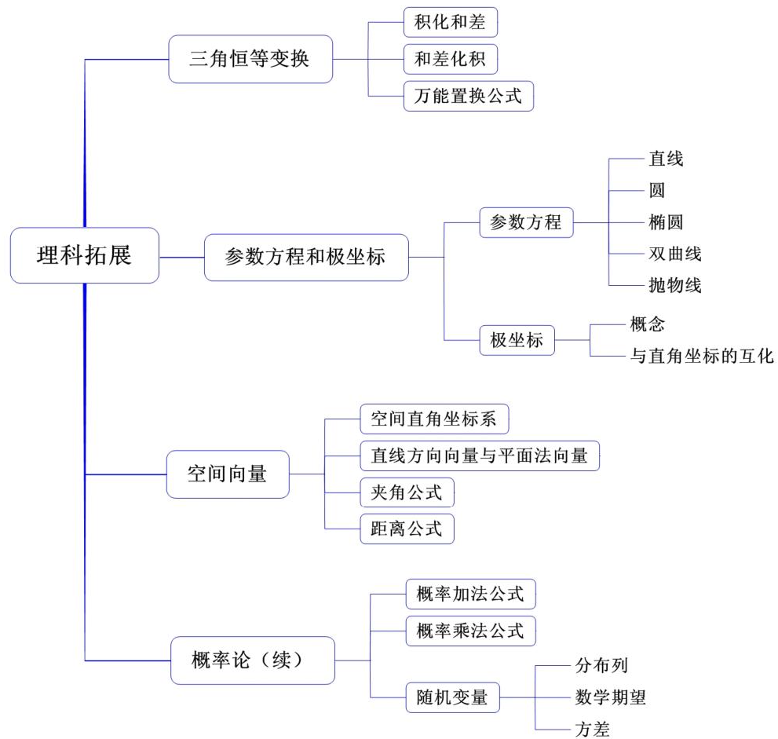
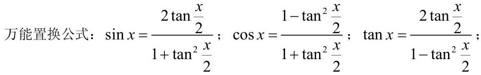
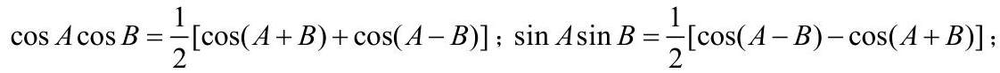
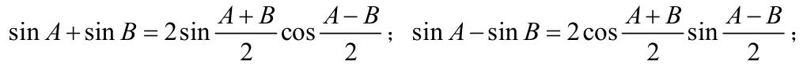
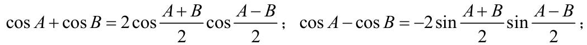

## 理科拓展专题

### 1. 三角恒等变换

[待核验：b0004](assets/p0001-b0004.png)

> 输出的完整性或结构尚未确认，请核对原图。

## (1) 积化和差公式

$$
\sin A\cos B=\frac{1}{2}[\sin(A+B)+\sin(A-B)]\text{；}\cos A\sin B=\frac{1}{2}[\sin(A+B)-\sin(A-B)]\text{；}
$$

[待核验：b0007](assets/p0001-b0007.png)

> 输出的完整性或结构尚未确认，请核对原图。

## (2) 和差化积公式

[待核验：b0009](assets/p0001-b0009.png)

> 输出的完整性或结构尚未确认，请核对原图。

[待核验：b0010](assets/p0001-b0010.png)

> 输出的完整性或结构尚未确认，请核对原图。
