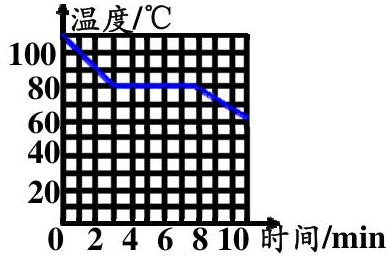
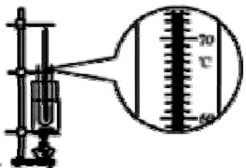
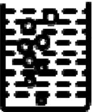
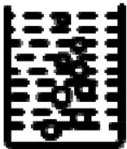

27. 在 “观察水的沸腾的实验” 中，小明的实验记录表格如下：

(1)在烧杯上盖上硬纸片，是为了___。观察到当水沸腾时，水中形成大量的气泡上升到水面破裂开来，里面的水蒸气散发到空气中。从实验可得出，沸腾是从液体___和___同时发生的剧烈的___现象。液体在沸腾过程中要___热，但温度___。

<table><tr><td>时间(分)</td><td>0</td><td>1</td><td>2</td><td>3</td><td>4</td><td>5</td><td>6</td><td>7</td><td>8</td></tr><tr><td>温度(°C)</td><td>90°C</td><td>92°C</td><td>94°C</td><td>96°C</td><td>98°C</td><td>99°C</td><td>99°C</td><td>96°C</td><td>99°C</td></tr></table>

28. 如图乙所示，是探究某液态物质凝固过程中温度随时间变化的实验装置，依据实验数据描绘出了该液态物质在凝固过程中温度随时间变化的图像，如图甲所示。由图像可知该物质是___（填“晶体”或“非晶体”），该液态物质从开始凝固到完全凝固所用的时间是___min，8s末温度计的示数如图乙所示，温度计的示数是___℃。

## 甲

## 乙

(3)由表可知，加热了___分钟水开始沸腾，水的沸点是___℃，水上方的大气压强___一个大气压(填“大于”或“小于”)。

(4)小丽观察到沸腾前和沸腾时水中气泡上升过程中的两种情况，如图(a)、(b)所示，则图___是水沸腾前的情况，图___是水沸腾时的情况。

## (a)

## (b)

29. 寒冷的冬天，居民楼的玻璃窗上会“出汗”或结“冰花”。下列说法不正确的是()

A. 玻璃窗上的“汗”是水蒸气液化生成的

B. 玻璃窗上的“冰花”是水蒸气凝华生成的

C. “冰花”结在玻璃窗的内表面

D. “汗”出在玻璃窗的外表面

30. 工厂要制造一种特殊用途的钢铝罐，钢罐内表面要压接一层0.25mm厚的铝膜，一时难住了焊接和锻压专家。后经技术人员的联合攻关解决了这一难题：他们先把铝膜紧贴到钢罐内表面，再往钢罐内灌满水，插入冷冻管使水结冰，然后铝膜与钢罐就压接在一起了。其原因是（）

A. 铝膜与钢罐间的水把它们冻牢了

B. 结冰时铝膜与钢罐间的冰把它们粘牢了

C. 水结冰时膨胀产生的巨大压力把它们压牢了

D. 水结冰时放出的热量把它们焊牢了

6

